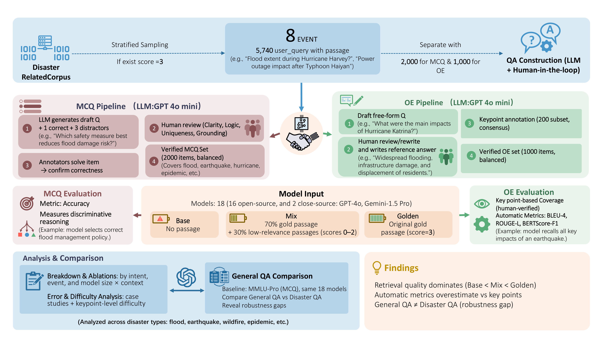

# 🧠 DisastQA: Datasets and Evaluation for Disaster-Domain Question Answering

**DisastQA** is the first large-scale benchmark for disaster-response question answering (QA).
It explicitly models retrieval uncertainty and factual completeness—two defining characteristics of real disaster scenarios—to evaluate how well LLMs reason and respond under incomplete, noisy, or conflicting information.

DisastQA provides:
- 3,000 rigorously verified questions (2,000 MCQ + 1,000 OE)
- 8 disaster types across meteorological, geophysical, hydrological, climatological, biological, technological, extraterrestrial, and conflict-induced events
- Human–LLM collaborative construction pipeline with expert validation
- Novel keypoint-based evaluation for factual completeness
- Retrieval-aware settings: Base, Mix, and Golden to separate model knowledge from evidence use

---

## 🌍 Motivation

Accurate QA during disasters is critical for decision-making and crisis management, yet existing benchmarks (e.g., SQuAD, MMLU-Pro) target general or professional domains and fail to capture disaster-specific uncertainty.
Real-world disaster information is fragmented, noisy, and multi-fact—models must synthesize multiple atomic facts (e.g., hazard, location, casualty, response).

DisastQA bridges this gap by providing a retrieval-aware, factual, and human-validated benchmark for evaluating LLM reliability in high-stakes scenarios.

---

## 📚 Key Features and Contributions

- **Retrieval-Aware Design**: Evaluates models under Base (no context), Mix (noisy retrieval), and Golden (oracle evidence) settings.
- **Human–LLM Pipeline**: Combines LLM scalability with expert validation and rewriting (~40% human-revised).
- **Keypoint-Based Evaluation**: A novel factual-completeness metric measuring how many atomic facts a model correctly reproduces.
- **Dual QA Tracks**:
  - MCQ: Tests discriminative reasoning and factual discrimination.
  - OE: Tests factual completeness, keypoint recall, and reasoning depth.
- **Comprehensive Evaluation**: 20 LLMs (0.6B–8B + APIs) benchmarked under consistent retrieval contexts.

---

## 🧩 Repository Structure

The repository focuses on the evaluation datasets and scoring scripts to facilitate reproducibility of the paper's results.

```
DisastQA/
├── DATA/
│   ├── final_mcq/                   # Dataset: base_2000.json, mix_2000.json, golden_2000.json
│   ├── final_OE/                    # Dataset: base/mix/golden_oe_with_difficulty.json
│   ├── MCQ_evaluation/              # Scripts: evaluation for MCQ (accuracy)
│   └── OE_evaluation/               # Scripts: evaluation for OE (keypoint coverage)
│
├── assets/
│   └── pipeline.png                 # Figure: Pipeline diagram
│
├── requirements.txt
├── LICENSE
└── README.md
```

---

## ⚙️ Data Pipeline Summary

To construct DisastQA, we employed a Human-LLM collaborative pipeline (detailed in the paper):

1. **Extraction**: Extract (query, passage) pairs with relevance score = 3 from DisastIR corpus.
2. **Drafting**: Use an LLM to rewrite queries → QA-style questions (MCQ/OE).
3. **Refinement**: Human annotators rewrite, validate, and construct distractors or reference answers.
4. **Validation**: Verify every item through multi-annotator solve-checking and consensus resolution.
5. **Stratification**: Generate difficulty levels via keypoint count (OE).
6. **Evaluation**: Evaluate 20 models under Base, Mix, and Golden settings.

---

## 🧮 DisastQA Construction Pipeline

<p align="center">

</p>

*Figure: Overview of the Human–LLM collaborative pipeline. The pipeline integrates query rewriting, human validation, and keypoint-based evaluation across MCQ and OE tracks.*

---

## 🚀 Quick Start

### 1️⃣ Prerequisites

- Python 3.8+ (tested with Python 3.8-3.12)
- CUDA-capable GPU (recommended for local model evaluation)
- At least 16GB GPU memory for 7B-8B models

### 2️⃣ Installation

```bash
# Clone the repository
git clone https://github.com/anonymous/DisastQA.git
cd DisastQA

# Install dependencies
pip install -r requirements.txt
```

### 3️⃣ Configure Model Paths

The evaluation scripts use model configurations defined in `DATA/MCQ_evaluation/local_evaluation.py` and `DATA/OE_evaluation/local_evaluation_with_difficulty.py`.

**To use your own models**, you need to:
1. Download models to a local directory (e.g., `DATA/models/`)
2. Update the `MODEL_CONFIGS` dictionary in the evaluation scripts with your model paths

Example configuration inside the python scripts:
```python
MODEL_CONFIGS = {
    "qwen-3-8b": {
        "path": "/path/to/your/models/qwen-3-8b",
        "torch_dtype": torch.float16,
        "device_map": "auto",
    },
    # ... add more models
}
```

### 4️⃣ Run MCQ Evaluation

The MCQ evaluation script automatically processes all three settings (base, mix, golden) for the specified model.

```bash
# Evaluate a specific model
python DATA/MCQ_evaluation/local_evaluation.py --model qwen-3-8b

# Evaluate all configured models (if no --model specified)
python DATA/MCQ_evaluation/local_evaluation.py

# Test mode (first 10 questions only)
python DATA/MCQ_evaluation/local_evaluation.py --model qwen-3-8b --test_mode
```

**Output**: Results are saved to `DATA/local_MCQ/{model_name}/{setting}_test.json`

### 5️⃣ Run OE Evaluation (Keypoint-Aware)

The OE evaluation script supports evaluating specific settings or all settings.

```bash
# Evaluate a specific model on all settings (base, mix, golden)
python DATA/OE_evaluation/local_evaluation_with_difficulty.py --model qwen-3-8b

# Evaluate specific settings only
python DATA/OE_evaluation/local_evaluation_with_difficulty.py \
  --model qwen-3-8b \
  --settings base,mix

# Test mode (first 10 questions only)
python DATA/OE_evaluation/local_evaluation_with_difficulty.py \
  --model qwen-3-8b \
  --test_mode
```

**Output**: Results are saved to `DATA/local_OE/{model_name}/{setting}_oe_with_difficulty.json`

### 6️⃣ Dataset Access

The final evaluation datasets are provided in `DATA/final_mcq/` and `DATA/final_OE/`. These datasets were constructed using the collaborative pipeline described above.

- **MCQ Data**: JSON files containing questions, options, and ground truth indices.
- **OE Data**: JSON files containing questions, reference answers, and annotated keypoints used for the coverage metric.

---

## 📊 Metrics

| Task | Metric | Purpose |
| --- | --- | --- |
| MCQ | Accuracy | Correct answer discrimination |
| OE | Keypoint Coverage | Factual completeness |
| OE | ROUGE-L / BLEU-4 / BERTScore | Surface-level overlap (for reference) |

Keypoint coverage explicitly measures whether models recall all essential disaster facts—e.g., hazard type, impact region, casualties, and response measures—offering a more trustworthy assessment than traditional overlap metrics.

---

## 🧠 Highlighted Findings

- **Retrieval quality strongly governs performance**: Base < Mix < Golden across all models, with GPT-5.2 achieving 93.1% accuracy in Base (no-context) setting.
- **Performance gaps narrow in optimal conditions**: Open models like Qwen-3-8B reach 99.65% MCQ accuracy under Golden retrieval, matching frontier models, but gaps persist in Base setting (88.7% vs. GPT-5.2's 93.1%).
- **Robustness to noise differs across models**: While GPT-5.2 achieves the highest absolute accuracy in Mix (96.7%), Gemini-3 Pro exhibits the strongest relative robustness with the smallest performance drop from Golden to Mix, indicating superior ability to filter irrelevant passages.
- **Factual completeness vs. fluency trade-off**: Gemini-3 Pro achieves 96.5% Keypoint Coverage (highest for OE), while GPT-5.2 reaches 99.65% MCQ accuracy (highest). Gemma-7B achieves high ROUGE-L scores but lower factual completeness, revealing a critical fluency-factuality trade-off.
- **Domain transfer gaps**: DisastQA rankings diverge substantially from general-domain benchmarks (Spearman's ρ ≈ 0.2 vs. MMLU-Pro), confirming that general-domain performance does not guarantee reliability in safety-critical scenarios.
- **High factual density**: OE answers contain on average 4.4 atomic keypoints (SD=1.55), reflecting the multi-fact reasoning complexity characteristic of disaster-response QA.
- **Surface metrics overestimate factuality**: ROUGE/BERTScore overestimate correctness—models often omit crucial quantitative details even when producing fluently written responses.

---

## 📈 Representative Results (Summary)

| Model | Params | MCQ (Golden) | OE Coverage (%) | Comment |
| --- | --- | --- | --- | --- |
| GPT-5.2 | — | 99.65 | 94.6 | Best MCQ accuracy |
| Gemini-3 Pro | — | 96.70 | 96.5 | Best factual completeness (OE) |
| GPT-4o | — | 99.35 | 95.4 | Strong overall performance |
| Gemini-1.5 Pro | — | 98.70 | 95.1 | Balanced fluency & accuracy |
| Qwen-3-8B | 8B | 99.65 | 94.0 | Best open-source MCQ model |
| Llama-3-8B | 8B | 99.10 | 93.4 | Strong reasoning; factual gaps |
| Gemma-7B | 8.5B | 98.10 | 89.7 | Best ROUGE-L, lower factuality |

(Full results and difficulty breakdowns are available in the paper and Appendix.)

---

## 🧩 Insights and Impact

- Retrieval-aware evaluation is essential for safety-critical domains; general-domain performance is not predictive of real-world reliability.
- Human-in-the-loop data curation remains vital for factual precision—LLM-only generation introduces ambiguity and hallucination.
- Keypoint-based evaluation provides a generalizable method for assessing factual completeness across any domain.

DisastQA thus serves as a foundation for future work on:
- Multi-turn reasoning and dynamic retrieval
- Domain adaptation and continual learning in emergencies
- Robust factual evaluation for trustworthy AI

---

## 🔧 Troubleshooting

**Error**: Model path does not exist
- **Solution**: Check that model paths in `MODEL_CONFIGS` are correct and models are downloaded locally.

**Error**: CUDA out of memory
- **Solution**: Use smaller batch sizes, reduce model precision (float16), or use a smaller model variant.

**Error**: ModuleNotFoundError
- **Solution**: Ensure all dependencies are installed via `pip install -r requirements.txt`.

---

## 🪪 License

This project is released under the MIT License. See `LICENSE` for details.

---

## 📬 Citation

If you use DisastQA in your research, please cite:

```bibtex
@dataset{disastqa_2025_anonymous,
  title   = {DisastQA: A Benchmark for Disaster-Domain Question Answering},
  author  = {Anonymous Authors},
  year    = {2025},
  note    = {Under Review}
}
```

---

## 🙌 Acknowledgments

This benchmark was developed by an academic research team in collaboration with disaster resilience and information retrieval experts. We thank all annotators for their rigorous contributions.

---

## 🔗 Repository

- **Repository**: [Link to Anonymous Repository]
- **Issues**: Please report bugs via GitHub Issues.

---
